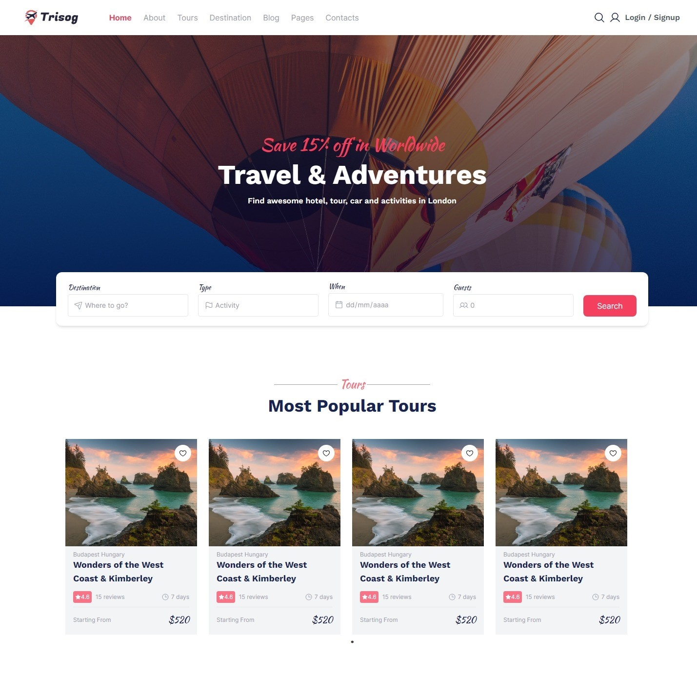

# Compass Challenge - Trisog UI

<div align="center">
    
    
  
  
  
  
  
  
  
</div>

<div align="center">
  <br/>
  
</div>

> The software developed, named Trisog, is a web application designed to provide a seamless experience similar to Airbnb, focusing on offering a comprehensive catalog of tours and travel experiences. The application allows users to explore, book, and manage tours, while enabling administrators to perform CRUD operations to maintain and update the tour listings effectively.

## Tópicos

:small_blue_diamond: [📫 Documentation](#-documentation)

:small_blue_diamond: [🗻 Challenge](#-challenge)

:small_blue_diamond: [🛠 Built with](#-built-with)

:small_blue_diamond: [🏡 Execution locally](#-execution-locally)

:small_blue_diamond: [📄 License](#-license)

## 📫 Documentation

The project documentation is available at the following links:

- [Figma Prototypes](https://www.figma.com/design/VGfRJ9g4gasvzlMscPltBw/Desafio-3?node-id=2816-3&t=PgtK2WlzMgG36FcY-1): This link provides access to Figma prototypes, showcasing the design and layout of the web application.

Be sure to review these documents to gain more insights into the landing page project and understand the design and functionality requirements. For more detailed information about the web application requirements, please refer to the [challenge](#-challenge) section.

## 🗻 Challenge

### Challenge Description

You will need to recreate the three pages mentioned above while staying true to your original design.

Delivery date: 08/03/2024 – 5:30 pm – Monday.

Each presentation will last a maximum of 10 minutes.

### The **MANDATORY** requirements are:

- Use front-end in React with TypeScript;
- Back-end in Node.js with TypeScript (mandatory);
- Prohibit the use of `any`;
- Database using MongoDB or SQLite;
- Have at least 30 tours in the database;
- Protect the Tours route;
- Create carousels to display the most popular tours and activity types in sections, using a library like [Splide](https://splidejs.com/). [Splide for React docs](https://splidejs.com/integration/react-splide/). **Feel free to use the library of your choice;**
- Use [Firebase](https://firebase.google.com/docs/auth?hl=pt-br) for user authentication, with options for email, Facebook, and Google logins;
- All functionalities must be implemented using the Node.js API, with no data persistence on the front-end;
- External libraries can be used for styling;
- Choose your own images;
- Create a private repository on your GitHub and add instructors as project collaborators;
- Add a README to your project;
- Make small commits and use Conventional Commits to keep your repository organized.

### The **ADDITIONAL** requirements are:

- Host all images in an S3 bucket or Firebase Storage.

### The **OPTIONAL** requirements are:

- Responsive application;
- Implement Destination and Destination Details pages.

## 🛠 Built with

- [React](https://reactjs.org/): Popular JavaScript library for building user interfaces.
- [Vite](https://vitejs.dev/): Next-generation front-end tooling that provides fast and optimized development experience.
- [TypeScript](https://www.typescriptlang.org/): JavaScript superset that adds static types and other features to the code.
- [Tailwind CSS](https://tailwindcss.com/): Utility-first CSS framework for rapidly building custom user interfaces.
- [npm](https://www.npmjs.com/): Package manager for JavaScript, providing fast and reliable dependency management.
- [Vercel](https://vercel.com/docs): Hosting platform that allows you to deploy web applications quickly and efficiently, with integrated CI/CD support.

These are the main technologies used to build this front-end application. JavaScript and React are utilized to create dynamic and interactive user interfaces. Vite is used as the build tool, offering fast and optimized development workflows. TypeScript adds static typing, enhancing code maintainability and robustness. Tailwind CSS provides utility-first classes to style the application quickly and efficiently. Sass is used for writing maintainable and modular CSS. CSS Modules help in creating reusable and scoped CSS. npm is the dependency manager, ensuring reliable and fast package management. The application is deployed on Vercel, ensuring scalable and high-performance hosting.

## 🏡 Execution locally

Follow the steps below to run the project locally on your machine:

* Clone this repository on your machine, entering the respective repository URL:
```
git clone https://github.com/ieVictor/trisog-frontend.git
```

* Navigate to the cloned project directory:
```
cd trisog-frontend
```

* Create a file called **_.env_** and correctly configure the necessary environment variables. You can use the **_.env.sample_** file as a reference.

* Now, install all dependencies listed in the 'package.json' file by running the following command:
```
npm install
```

* With the dependencies installed, run the following command to start the server:
```
npm run dev
```

* If you want to stop the application from running, press `Ctrl + C` in the terminal, the project execution will be terminated.

## 📝 License

This project is licensed under the terms of [License](LICENSE). Please see the LICENSE file for more details.

The license chosen for the project is an important element to establish the rights to use, distribute and modify the source code. It is essential that all users, contributors and stakeholders review and understand the license terms and conditions before using or contributing to the project.

It is recommended that you carefully read the LICENSE file to ensure compliance with established rules and proper use of the code provided in this repository.

[⬆ Back to the top](#compass-challenge---jukeboxer-ui)

